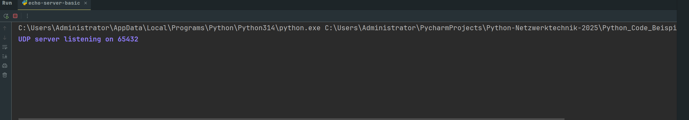
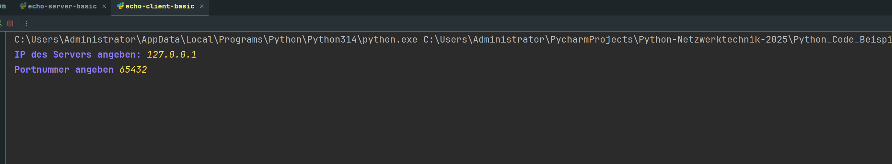
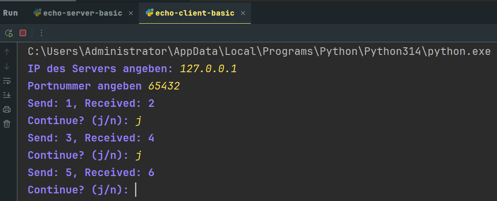
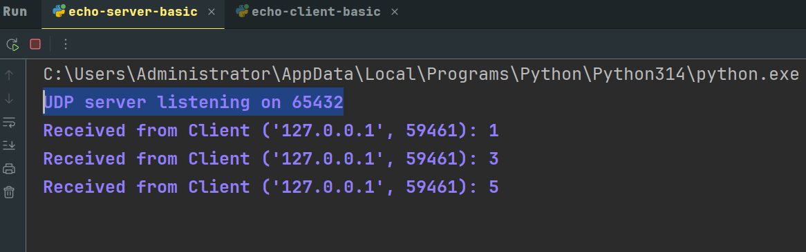

# **Dokumentation Python Projektarbeit Netzwerktechnik**

## Funktionsweise echo-server-basic.py echo-client-basic.py

1. Start Drücken bei echo server --> Es erscheint "UDP server listening on 65432"

2. Start Drücken bei echo client --> IP des Servers angeben "127.0.0.1" für Host + Portnummer beim Server

3. Beim Client erscheint **siehe Bild** --> Um weitere Pings zu senden "j", für abbruch "n"

5. Beim Server erscheint folgendes

6. Sobald n oder ein anderer Buchstabe als (J/j) eingegeben wird, Clint und Server werden beendet.

